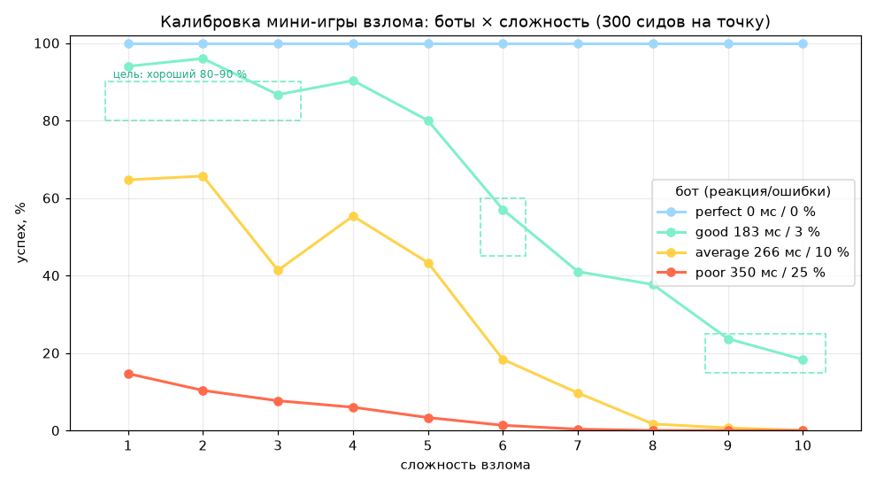

# Калибровка мини-игры взлома (TASK-018)

Команда (≈ 1 с, детерминированно): `cmake -S core -B build && cmake --build build && ./build/hack_calib --seeds 300 --markdown out.md --csv data/hack/calibration.csv`.
Боты — `core/include/iv/HackBot.h`: идеальный (решатель: игра сама знает эталонное решение), «хороший человек» (реакция 183 мс, 3 % ошибок), «средний» (266 мс, 10 %), «плохой» (350 мс, 25 %).
Модель человека: перед этапом он «читает экран» (2 реакции) и планирует маршрут (3 тика на ход); ход пути идёт с паузой 0,7 реакции; ритм — нажатие в такт с гауссовым разбросом
(σ = 0,1 реакции + 0,3 тика), частота — упреждающее нажатие с разбросом 0,18 реакции × скорость секторов; ошибка = неверное направление / пропуск импульса / пропуск замка.

## Вероятность успеха (300 сидов на клетку)

| Сложность | perfect 0 мс / 0 % | good 183 мс / 3 % | average 266 мс / 10 % | poor 350 мс / 25 % |
|---|---|---|---|---|
| 1 | 100,0 % | 94,0 % | 64,7 % | 14,7 % |
| 2 | 100,0 % | 96,0 % | 65,7 % | 10,3 % |
| 3 | 100,0 % | 86,7 % | 41,3 % | 7,7 % |
| 4 | 100,0 % | 90,3 % | 55,3 % | 6,0 % |
| 5 | 100,0 % | 80,0 % | 43,3 % | 3,3 % |
| 6 | 100,0 % | 57,0 % | 18,3 % | 1,3 % |
| 7 | 100,0 % | 41,0 % | 9,7 % | 0,3 % |
| 8 | 100,0 % | 37,7 % | 1,7 % | 0,0 % |
| 9 | 100,0 % | 23,7 % | 0,7 % | 0,0 % |
| 10 | 100,0 % | 18,3 % | 0,0 % | 0,0 % |

## Время, ошибки, качество (хороший человек) и время идеального прохода

| Сложность | Лимит, с | good: среднее время, с | good: ошибок | good: срабатываний ЛЬДА | good: quality побед | perfect: среднее время, с |
|---|---|---|---|---|---|---|
| 1 | 25 | 14,6 | 1,4 | 0,08 | 0,69 | 7,1 |
| 2 | 26 | 14,2 | 1,4 | 0,05 | 0,70 | 6,8 |
| 3 | 28 | 18,0 | 2,0 | 0,14 | 0,67 | 7,6 |
| 4 | 30 | 19,0 | 2,5 | 0,10 | 0,65 | 8,0 |
| 5 | 34 | 22,9 | 3,4 | 0,25 | 0,64 | 9,4 |
| 6 | 42 | 32,8 | 6,1 | 0,95 | 0,58 | 9,8 |
| 7 | 40 | 34,0 | 6,3 | 1,02 | 0,59 | 10,1 |
| 8 | 45 | 42,7 | 6,5 | 0,41 | 0,48 | 20,2 |
| 9 | 44 | 42,8 | 6,2 | 0,32 | 0,48 | 21,4 |
| 10 | 48 | 47,0 | 7,0 | 0,47 | 0,47 | 22,1 |

(Среднее время «good» на проигранных попытках равно лимиту, поэтому на высоких сложностях оно почти совпадает с ним.)

## Сверка с целями TASK-018

| Цель | Факт | Вывод |
|---|---|---|
| идеальный — 100 % на всех сложностях (иначе решаемость нарушена) | **100 %** на 10 сложностях × 300 сидов; в тестах — 10 × 100 полных партий + 5000 раскладок пути с проверкой эталонного решения | выполнено |
| хороший человек, сложности 1–3: 80–90 % | 94 / 96 / 86,7 % | 3 — в цели, 1–2 выше (+4…6 п.п.): первые уровни прощающие; ужесточить — уменьшить `hitWindow`/`lockHalfDeg` строк 1–2 в `Tuning.h` |
| сложность 6: 45–60 % | **57,0 %** | выполнено |
| сложности 9–10: 15–25 % | **23,7 % / 18,3 %** | выполнено |
| монотонность | почти: есть небольшие «зубцы» (сложность 4 лучше 3, 8 лучше 7), потому что с уровнем меняется состав этапов (с 8-го добавляется фаза-босс) | допустимо |

Что меняет сложность (все числа — `tune::kHackLevels` в `core/include/iv/Tuning.h`, копия — `data/hack/difficulty.json`): размеры сетки, число блокеров, ледяных узлов и ключей; число дорожек и импульсов, зазоры и окно попадания (в тиках);
число замков, ширина и сужение окна, скорость вращения; общий лимит времени 25–60 с; штраф за ошибку; нагрев ЛЬДА за ошибку. Сложность в бою даёт `HackGame::DifficultyFor(архетип врага, сложность ИИ, состояние плеча)`:
база 1 / 3 / 6, ± архетип (Counterpuncher, Grappler +1; Breaker, Gunner −1), − повреждение плеча (до −3).

## Ограничения (честно)

- Боты — модель, а не живой человек: реальные цифры могут отличаться в обе стороны (управление с геймпада, экран, привычка к жанру). Калибровочная таблица нужна, чтобы **менять числа осознанно**, а не как окончательная истина.
- Человек-боты видят все импульсы этапа заранее (на экране импульс виден за `kHackTravelTicks` = 1,5 с до линии), как и живой игрок.
- Таблица вшита в код (`kHackLevels`); файл `difficulty.json` — её копия для Unreal, тест `Hack.DifficultyTableMatchesTheJsonFile` сравнивает их побайтно.
